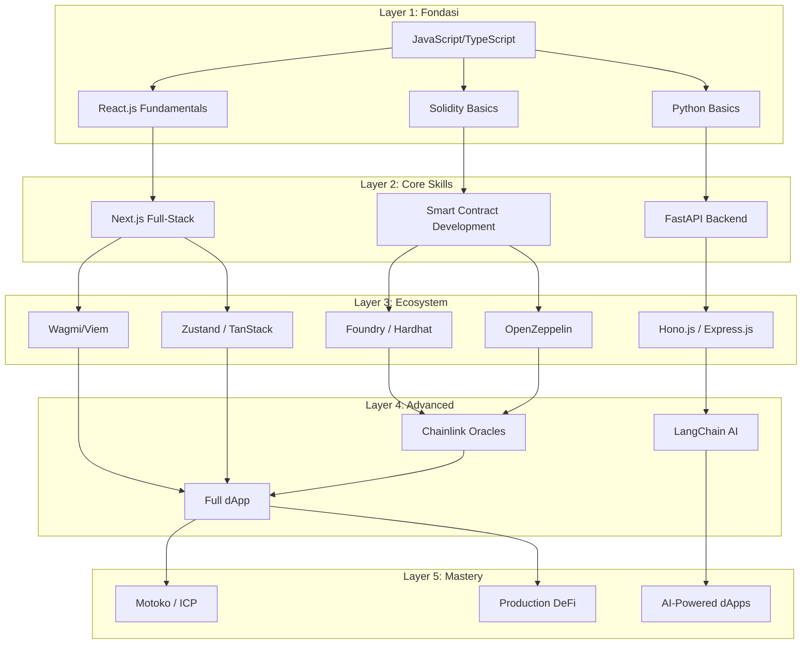
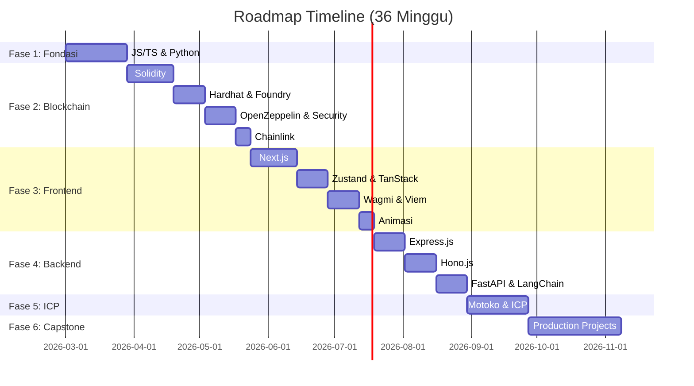

# 🗺️ Roadmap Penguasaan Tech Stack — Web3 Full-Stack Developer

> Berdasarkan analisis profil GitHub (116 repositories) dengan tech stack yang mencakup **Blockchain**, **Frontend**, **Backend**, dan **AI Integration**.

---

## 📊 Ringkasan Tech Stack yang Dianalisis

| Kategori | Teknologi |
|---|---|
| **Blockchain & Smart Contracts** | Solidity, Motoko (ICP), OpenZeppelin, Chainlink, Foundry, Hardhat |
| **Frontend & Interface** | Next.js, Wagmi/Viem, Zustand, TanStack, Framer Motion, GSAP |
| **Backend** | Hono.js, Express.js, FastAPI, LangChain |

---

## 🏗️ Arsitektur Keseluruhan

---

## 🚀 FASE 1: Fondasi Programming (Minggu 1–4)

> **Tujuan:** Kuasai bahasa dasar yang menjadi pondasi seluruh tech stack.

### 📌 JavaScript / TypeScript
- [ ] ES6+ (arrow functions, destructuring, async/await, modules)
- [ ] TypeScript fundamentals (types, interfaces, generics, enums)
- [ ] Node.js runtime & npm ecosystem
- [ ] **Proyek:** Buat CLI tool sederhana dengan TypeScript

### 📌 Python Basics
- [ ] Syntax, data structures, OOP
- [ ] Virtual environments & pip
- [ ] Async programming dengan asyncio
- [ ] **Proyek:** Buat REST API sederhana dengan Flask/FastAPI

### 📌 DSA & Problem Solving
- [ ] Sesuaikan dengan struktur `leetcodeGranding` (prioritas interview):
  - `tier-1-foundation` (Minggu 1-6) → Array, String, Hash Map, Two Pointer, Binary Search, Stack, Sliding Window, Heap
  - `tier-2-core` (Minggu 7-11) → Linked List, Tree, BST, Graph, BFS/DFS, Union Find
  - `tier-3-advanced` (Minggu 12-16) → DP, Backtracking, Greedy, Trie, Design Problems, Hard

### 🎯 Milestone Fase 1
> Bisa menulis TypeScript & Python dengan percaya diri. Sudah menyelesaikan Tier 1 LeetCode (Foundation).

---

## ⛓️ FASE 2: Blockchain & Smart Contracts (Minggu 5–12)

> **Tujuan:** Kuasai development smart contract dari nol hingga production-ready.

### 📌 2.1 — Solidity Fundamentals (Minggu 5–7)
- [ ] Blockchain basics (consensus, EVM, gas, transactions)
- [ ] Solidity syntax: variables, functions, modifiers, events
- [ ] Data types & storage (storage vs memory vs calldata)
- [ ] Inheritance & interfaces
- [ ] Error handling (require, revert, custom errors)
- [ ] **Proyek:** Buat ERC-20 token dari scratch

### 📌 2.2 — Development Tooling (Minggu 7–8)

#### Hardhat
- [ ] Setup project & config
- [ ] Writing & running tests (Mocha/Chai)
- [ ] Deploy scripts & network configuration
- [ ] Hardhat plugins (etherscan verification, gas reporter)
- [ ] **Proyek:** Deploy ERC-20 ke testnet dengan Hardhat

#### Foundry
- [ ] Forge, Cast, Anvil basics
- [ ] Writing tests dalam Solidity (forge test)
- [ ] Fuzz testing & invariant testing
- [ ] Script deployment dengan `forge script`
- [ ] **Proyek:** Migrate Hardhat project ke Foundry, tambah fuzz tests

### 📌 2.3 — OpenZeppelin & Security (Minggu 9–10)
- [ ] OpenZeppelin Contracts library (ERC-20, ERC-721, ERC-1155)
- [ ] Access Control (Ownable, Roles)
- [ ] Upgradeable contracts (Proxy patterns)
- [ ] Security best practices (reentrancy, overflow, front-running)
- [ ] Common vulnerability patterns (SWC registry)
- [ ] **Proyek:** Buat NFT marketplace contract menggunakan OpenZeppelin

### 📌 2.4 — Chainlink Integration (Minggu 11–12)
- [ ] Chainlink Price Feeds
- [ ] Chainlink VRF (Verifiable Random Function)
- [ ] Chainlink Automation (Keepers)
- [ ] Chainlink CCIP (Cross-chain messaging)
- [ ] **Proyek:** Buat lottery/raffle contract dengan Chainlink VRF + Automation

### 🎯 Milestone Fase 2
> Mampu menulis, testing, dan deploy smart contract yang aman. Familiar dengan tooling Foundry & Hardhat.

---

## 🎨 FASE 3: Frontend & Web3 Interface (Minggu 13–20)

> **Tujuan:** Kuasai frontend modern dan integrasikan dengan blockchain.

### 📌 3.1 — Next.js Mastery (Minggu 13–15)
- [ ] App Router architecture (layouts, pages, loading, error)
- [ ] Server Components vs Client Components
- [ ] Server Actions & Data Fetching
- [ ] API Routes & Middleware
- [ ] SSR, SSG, ISR strategies
- [ ] Image optimization & performance
- [ ] **Proyek:** Buat portfolio website dengan Next.js App Router

### 📌 3.2 — State Management & Data (Minggu 16–17)

#### Zustand
- [ ] Store creation & usage
- [ ] Middleware (persist, devtools, immer)
- [ ] Store slicing & modular state
- [ ] Comparison dengan Redux/Context

#### TanStack (React Query)
- [ ] Queries, mutations, invalidation
- [ ] Caching strategies & optimistic updates
- [ ] Infinite queries & pagination
- [ ] Integration dengan Zustand
- [ ] **Proyek:** Dashboard app dengan Zustand + TanStack Query

### 📌 3.3 — Wagmi/Viem (Web3 Frontend) (Minggu 17–19)
- [ ] Viem: TypeScript-first Ethereum library
  - [ ] Public client, wallet client
  - [ ] Contract reads & writes
  - [ ] Event listening & logs
- [ ] Wagmi: React Hooks for Ethereum
  - [ ] useAccount, useConnect, useDisconnect
  - [ ] useContractRead, useContractWrite
  - [ ] useWaitForTransaction
  - [ ] Multi-chain configuration
- [ ] Wallet connection (MetaMask, WalletConnect, Coinbase)
- [ ] **Proyek:** Buat dApp frontend yang connect ke smart contract Fase 2

### 📌 3.4 — Animasi & UX (Minggu 19–20)

#### Framer Motion
- [ ] Basic animations (animate, initial, exit)
- [ ] Gestures (drag, tap, hover)
- [ ] Layout animations & AnimatePresence
- [ ] Complex orchestration (stagger, variants)

#### GSAP
- [ ] Tweens & Timelines
- [ ] ScrollTrigger
- [ ] Text & SVG animations
- [ ] Performance optimization
- [ ] **Proyek:** Buat landing page Web3 dengan animasi premium

### 🎯 Milestone Fase 3
> Bisa membuat frontend Next.js yang terhubung dengan smart contract. Animasi smooth dan UX premium.

---

## ⚡ FASE 4: Backend Development (Minggu 21–26)

> **Tujuan:** Kuasai backend modern untuk mendukung dApps dan AI services.

### 📌 4.1 — Express.js (Minggu 21–22)
- [ ] Routing, middleware, error handling
- [ ] Authentication (JWT, sessions)
- [ ] Database integration (MongoDB/PostgreSQL)
- [ ] REST API design best practices
- [ ] **Proyek:** Buat REST API untuk NFT metadata service

### 📌 4.2 — Hono.js (Minggu 23–24)
- [ ] Ultrafast routing & middleware
- [ ] Edge deployment (Cloudflare Workers, Vercel Edge)
- [ ] Validation dengan Zod
- [ ] Authentication & CORS
- [ ] Migration dari Express ke Hono
- [ ] **Proyek:** Buat edge API untuk token price aggregator

### 📌 4.3 — FastAPI + LangChain (Minggu 25–26)
- [ ] FastAPI: async endpoints, Pydantic models, dependency injection
- [ ] LangChain fundamentals:
  - [ ] LLMs, Prompts, Chains
  - [ ] RAG (Retrieval Augmented Generation)
  - [ ] Agents & Tools
  - [ ] Vector stores & embeddings
- [ ] **Proyek:** Buat AI chatbot backend yang bisa menjawab pertanyaan tentang smart contract

### 🎯 Milestone Fase 4
> Mampu membuat backend API dengan Hono.js/Express.js dan mengintegrasikan AI via FastAPI + LangChain.

---

## 🌐 FASE 5: Internet Computer & Motoko (Minggu 27–30)

> **Tujuan:** Ekspansi ke ekosistem ICP sebagai alternatif EVM.

### 📌 5.1 — ICP Fundamentals (Minggu 27–28)
- [ ] Internet Computer architecture (canisters, cycles, subnets)
- [ ] DFX CLI & local development
- [ ] Motoko language basics
  - [ ] Actor model
  - [ ] Types & pattern matching
  - [ ] Async/await dalam Motoko
  - [ ] Stable variables & upgrades
- [ ] **Proyek:** Deploy canister "Hello World" ke ICP

### 📌 5.2 — Advanced ICP (Minggu 29–30)
- [ ] Multi-canister architecture
- [ ] Internet Identity (authentication)
- [ ] HTTPS Outcalls
- [ ] ICP ↔ EVM bridge concepts
- [ ] **Proyek:** Buat full-stack dApp di ICP (frontend + backend canister)

### 🎯 Milestone Fase 5
> Mampu build dan deploy aplikasi di Internet Computer menggunakan Motoko.

---

## 🏆 FASE 6: Production Projects & Mastery (Minggu 31–36)

> **Tujuan:** Integrasikan semua skill dalam proyek-proyek production-level.

### 📌 Proyek Capstone

#### 🔷 Proyek 1: DeFi Protocol
- [ ] Smart contracts: Solidity + Foundry + OpenZeppelin + Chainlink
- [ ] Frontend: Next.js + Wagmi/Viem + Zustand + Framer Motion
- [ ] Backend: Hono.js untuk indexing & caching
- [ ] Features: Lending/borrowing, liquidity pools, governance

#### 🔷 Proyek 2: AI-Powered NFT Platform
- [ ] Smart contracts: ERC-721 + marketplace contracts
- [ ] Frontend: Next.js + TanStack + GSAP animations
- [ ] Backend: FastAPI + LangChain untuk AI-generated NFT descriptions
- [ ] Features: Mint, trade, AI art descriptions, analytics

#### 🔷 Proyek 3: Cross-Chain dApp
- [ ] EVM smart contracts + ICP Motoko canisters
- [ ] Multi-chain frontend dengan Wagmi
- [ ] Edge backend dengan Hono.js
- [ ] Features: Cross-chain asset management

### 🎯 Milestone Fase 6
> Memiliki 3 proyek production-level yang mendemonstrasikan penguasaan seluruh tech stack.

---

## 📅 Timeline Overview

---

## 📚 Sumber Belajar Rekomendasi

| Teknologi | Resource |
|---|---|
| **Solidity** | [CryptoZombies](https://cryptozombies.io), [Solidity by Example](https://solidity-by-example.org), Patrick Collins (Cyfrin Updraft) |
| **Foundry** | [Foundry Book](https://book.getfoundry.sh) |
| **Hardhat** | [Hardhat Docs](https://hardhat.org/docs) |
| **OpenZeppelin** | [OpenZeppelin Docs](https://docs.openzeppelin.com) |
| **Chainlink** | [Chainlink Docs](https://docs.chain.link) |
| **Next.js** | [Next.js Docs](https://nextjs.org/docs), Lee Robinson YouTube |
| **Wagmi/Viem** | [Wagmi Docs](https://wagmi.sh), [Viem Docs](https://viem.sh) |
| **Zustand** | [Zustand GitHub](https://github.com/pmndrs/zustand) |
| **TanStack** | [TanStack Query Docs](https://tanstack.com/query) |
| **Framer Motion** | [Motion Docs](https://motion.dev) |
| **GSAP** | [GSAP Docs](https://gsap.com/docs) |
| **Hono.js** | [Hono Docs](https://hono.dev) |
| **FastAPI** | [FastAPI Docs](https://fastapi.tiangolo.com) |
| **LangChain** | [LangChain Docs](https://python.langchain.com) |
| **Motoko** | [Motoko Docs](https://internetcomputer.org/docs/motoko) |

---

## 💡 Tips Strategi Belajar

1. **Build > Read** — Setiap konsep harus langsung dipraktikkan dengan proyek mini
2. **Document everything** — Push semua proyek ke GitHub, tulis README yang baik
3. **Contribute to OSS** — Setelah Fase 2, mulai contribute ke repo OpenZeppelin/Foundry
4. **Join communities** — ETHGlobal hackathons, ICP developer grants
5. **Parallel LeetCode** — Terus kerjakan LeetCode bersamaan untuk menjaga skill DSA

---

> **Estimasi Total:** ~36 minggu (9 bulan) untuk penguasaan komprehensif.
> Bisa dipercepat menjadi ~24 minggu jika fokus full-time.
